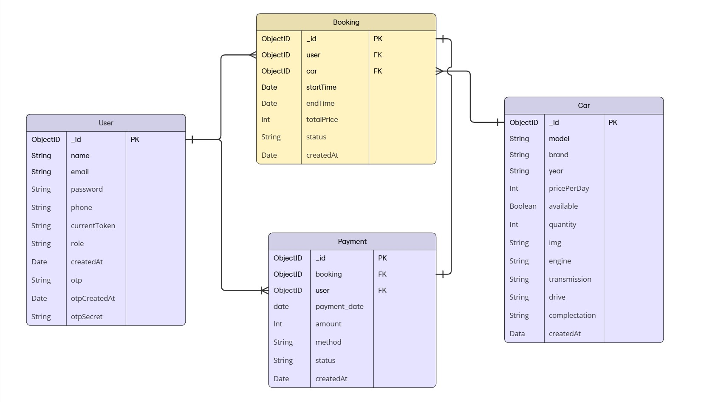

# Car Rent

CarRent - Car Sharing and Rental Platform CarRent is a robust car-sharing and rental platform designed to streamline the process of booking, managing, and tracking car rentals. This platform supports both customers and administrators with powerful features for smooth operations.

## Project Goals
- Seamless Car Rental Process: Provide an intuitive interface for customers to search, book, and manage car rentals easily.  
- Advanced Admin Management: Allow administrators to oversee bookings, manage users, and generate detailed reports for better business insights.   
- Scalable Architecture: Ensure the system is optimized for performance, handling large volumes of bookings and users effectively.   
- Secure Data Handling: Implement secure authentication, authorization, and data encryption for safe user interactions.

## Core Features 
### For Customers: 
- User Registration & Authentication: Secure sign-up, login, password recovery, and OTP verification.  
- Car Listings with Filters: Advanced search and filter options based on brand, engine, transmission, drive type, and price range.   
- Booking Management: Book, view, modify, or cancel reservations with ease.   
- Payment Integration: Secure payment processing with history tracking. Booking History: Access to past bookings and payment records.

### For Admins:
- Dashboard Access: Manage cars, bookings, payments, and users from a centralized dashboard.   
- Advanced Data Reporting: Generate insightful reports using aggregation pipelines (revenue per user, bookings per status, etc.).   
- Automated Cleanup: Scheduled tasks to clean expired bookings and failed payments.


## System Architecture Overview

This project follows the Model-View-Controller (MVC) pattern, ensuring a well-structured and modular application.

Backend (Node.js + Express + MongoDB)
Controllers: Handle business logic for cars, users, bookings, and payments.  
Models: Define data schemas using Mongoose for MongoDB.  
Routes: API endpoints for interacting with the database.  
Middleware: Authentication, validation, and security layers.


Frontend (HTML, CSS, JavaScript, Bootstrap, Vue.js)  
User Dashboard: Browse cars, make bookings, and track payments.  
Admin Panel: Manage vehicles, users, and bookings.  
Real-Time Features: Dynamic updates for available cars and pricing.


## ERD




## Features & Technologies Used
### Features

- User Authentication (JWT & bcrypt)

- Car Browsing & Filtering (Brand, Price, Transmission, Fuel Type)

- Real-Time Booking System (With automatic car availability updates)

- Payment Processing (Stripe/PayPal API integration)

- Admin Management Panel (CRUD operations for cars, bookings, and users)

- Analytics & Reports (Using Aggregation Pipelines in MongoDB)

### Technologies Used

- Backend: Node.js, Express.js, MongoDB (Mongoose), JWT, bcrypt

- Frontend: HTML, CSS, JavaScript, Bootstrap, Vue.js

- Database Optimization: Compound Indexes, Aggregation Pipelines

- Data Collection : Extract and import data from a relevant external source [auto.ru](https://auto.ru/)

# Deployment: Render
## Installation & Setup

1️⃣ Clone the repository

```bash
  git clone https://github.com/pinokiochan/car-sharing
  cd CarRent
```

2️⃣ Install dependencies
```bash
  npm install
```

3️⃣ Set up environment variables (.env)
```bash
  MONGODB_URI=your_mongo_connection_string
  JWT_SECRET=your_secret_key
```

4️⃣ Start the server
```bash
  npm run dev
```
## Security & Authentication

- User Authentication using JWT tokens for secure API access.

- Bcrypt Password Hashing for storing passwords securely.

- Access Control Middleware to restrict admin & user access.
## API Endpoints

```http
  Authentication API
```

| Parameter | Type     | Description                |
| :-------- | :------- | :------------------------- |
| `/api/auth/register` | `POST` | Register a new user |
| `/api/auth/login` | `POST` | Log in and obtain a JWT token |
| `/api/auth/logout` | `POST` | Log out the user and invalidate the token |
| `/api/auth/forgot-password` | `POST` | Request a password reset link |
| `/api/auth/reset-password` | `POST` | Reset the user password using a token |


```http
  Cars API
```

| Parameter | Type     | Description                |
| :-------- | :------- | :------------------------- |
| `/api/cars` | `GET` | Retrieve all available cars |
| `/api/cars/:id` | `GET` | Retrieve a specific car by ID |
| `/api/cars` | `POST` | Add a new car listing |
| `/api/cars/:id` | `PUT` | Update an existing car listing |
| `/api/cars/:id` | `DELETE` | Remove a car listing |

```http
  Booking API
```

| Parameter | Type     | Description                |
| :-------- | :------- | :------------------------- |
| `/api/bookings` | `POST` | Create a new car booking |
| `/api/bookings/user` | `GET` | Retrieve all bookings for a user |
| `/api/bookings/:id` | `GET` | Retrieve booking details by ID |
| `/api/bookings/:id` | `PUT` | Update the status of a booking |
| `/api/bookings/:id` | `DELETE` | Cancel a booking |


```http
  Payment API
```

| Parameter | Type     | Description                |
| :-------- | :------- | :------------------------- |
| `/api/payments` | `POST` | Process a car rental payment |
| `/api/payments/user` | `GET` | Retrieve all payments for a user |
| `/api/payments/:id` | `GET` | Retrieve payment details by ID |
| `/api/payments/:id` | `PUT` | Update payment status |
| `/api/payments/:id` | `DELETE` | Cancel a payment |

```http
  Analytics & Admin API
```

| Parameter | Type     | Description                |
| :-------- | :------- | :------------------------- |
| `/api/admin/users` | `GET` | Retrieve all registered users |
| `/api/admin/users/:id` | `DELETE` | Remove a user account |
|`/api/admin/users/:id` | `PUT` | Edit a user account |
| `/api/admin/analytics/bookings` | `GET` | Retrieve booking analytics |
| `/api/admin/analytics/payments` | `GET` | Retrieve payment statistics |


 Additional Information
--
- JWT Authentication is required for most API endpoints.

- Include the Authorization Header with a Bearer Token:
```bash
  Authorization: Bearer <your_token_here>
```
Admin routes require an Admin Role.
## Future Enhancements
- Multi-language Support (Localization for UI & API)  
- Google Maps API Integration for Nearby Car Locations  
- AI-based Dynamic Pricing for Rental Cost Adjustments  
- Push Notifications for Booking Reminders  
## Contributing
Fork the repository  
Create a new branch  
Make changes & commit  
Submit a Pull Request  
All contributions are welcome!
## Team members
Group: SE-2308
Participants: Beibars Yergali, Merey Ibraim
Email: beibarys7ergaliev@gmail.com or 231140@astanait.edu.kz 
Website: [Car Rent](https://car-sharing-jgjh.onrender.com)
